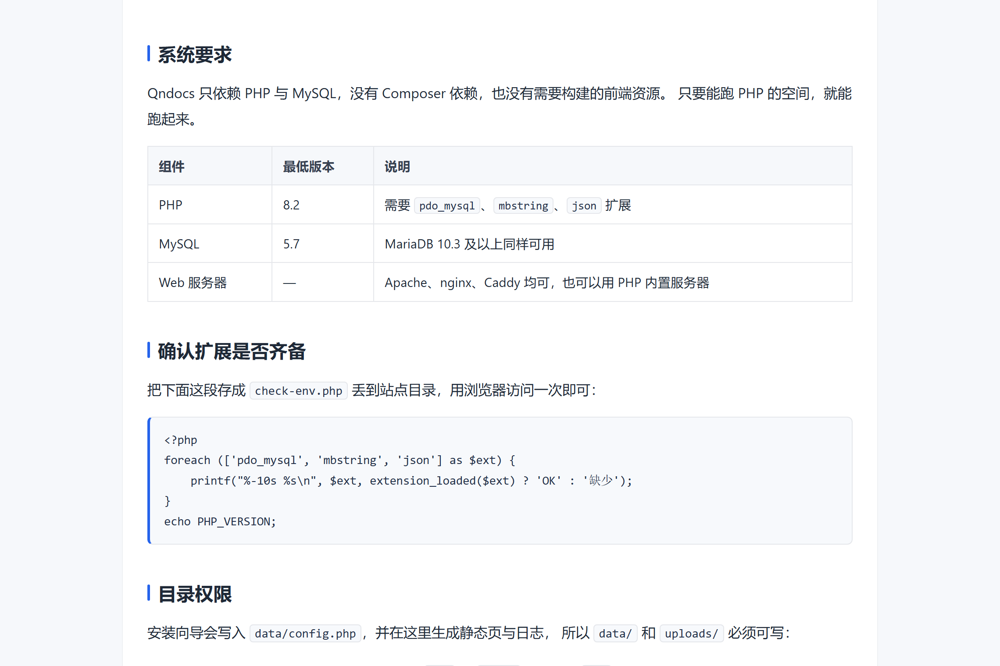
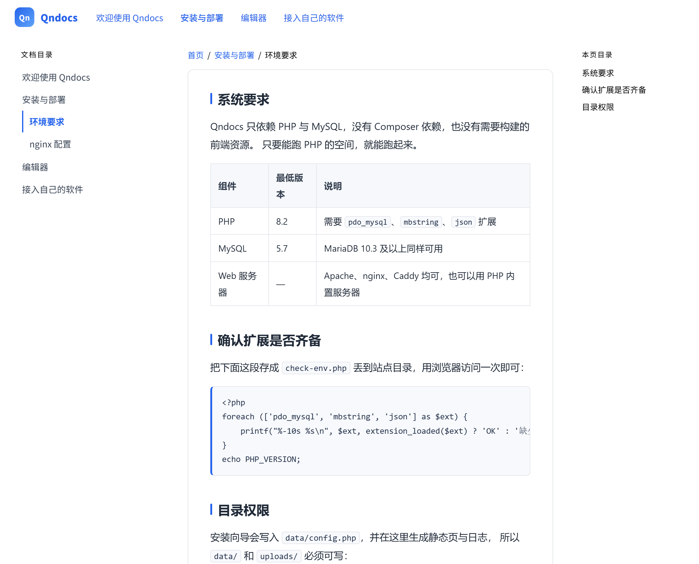

<div align="center">

# Qndocs

**原生 PHP 文档系统 —— 每篇文档都是一个可以独立存在的 HTML**

零依赖 · 无框架 · 无 Composer · 无构建步骤

[](LICENSE)


</div>

---

后台写完文档，前台就得到一个**干净的 HTML**：既可以直接嵌进你自己的软件，
也可以一键切换成带目录侧栏的**完整文档站**。

```bash
# 下载后丢进 Web 根目录，浏览器打开一次，按向导走完四步 —— 结束。
# 不需要 composer install，不需要 npm run build，不需要 docker compose up。
```

## 为什么做这个

现成的文档方案大多建立在 Markdown + 静态站点生成器之上，它们默认输出的是
**"一个站点里的一页"**：带页头、页脚、侧边栏、一堆全局脚本与样式。

一旦你要把文档**插进自己的软件**（桌面客户端的内嵌面板、Qt / Electron 的 WebView、
移动端 App 的帮助页），就会撞上三件事：

1. 页头页脚甩不掉，得靠 CSS 硬遮盖；
2. 站点样式和你的软件界面**互相污染**；
3. 想只要"正文文字"喂给别的程序，得自己写正则去标签。

Qndocs 把这件事反过来做：**文档首先是一个可以独立存在的 HTML 文件**。

- 每篇文档默认只有一个 `<article class="qn-doc">`，没有页头、页脚、侧栏、导航、脚本；
- 所有 CSS 规则都限定在 `.qn-doc` 作用域内，变量也定义在 `.qn-doc` 上，
  嵌进任何页面都**不会污染**宿主样式；
- 同一份内容额外提供 `?fragment=1`（样式 + 正文）、`?bare=1`（只有正文）、
  `?text=1`（纯文本，`text/plain`）三种取法；
- 需要给人浏览时，后台切一下「输出模式」就能变成完整的文档站，**内容一个字都不用改**。

整个项目是原生 PHP：没有 Composer 依赖、没有前端框架、没有构建产物，
丢到任何支持 PHP 8.2 的空间上就能跑。

## 两种角色，三层自由

这是 Qndocs 的设计核心：**输出框架、内容形式、取用方式彼此独立，可以任意组合**。

### 第一层 · 站点级：输出模式

后台「站点设置 → 输出模式」，随时切换，静态页自动重建：

| 输出模式 | 前台长什么样 | 适合 |
| --- | --- | --- |
| **独立文档**（默认） | 每篇只有正文，**没有**页头、页脚、侧栏、导航、脚本 | 把文档插入自己的软件（WebView / iframe / 内嵌面板） |
| **整合文档站** | 页头 + 侧边文档树 + 右栏本页目录 + 面包屑 + 上一篇/下一篇 + 页脚 | 用浏览器当一整套文档站来浏览 |

两种模式共用同一批文档、同一套配色（样式中心里的变量两边都生效）。

### 第二层 · 文档级：内容类型

编辑器左上角切换，按文档单独设置：

| 内容类型 | 编辑器形态 | 保存与输出 |
| --- | --- | --- |
| **富文本**（默认） | 所见即所得，标题、列表、表格、代码块、图片、链接…… | 保存为 HTML |
| **纯文本** | 等宽的原生文本框，**一个字符都不改**（缩进、空行原样保留） | 前台渲染为 `<pre class="qn-text">` |

纯文本适合放配置文件、命令、日志片段、许可证原文这类"排版会帮倒忙"的内容。

### 第三层 · URL 级：取用形式

任何模式下都只返回内容本体，永远不会把整站框架带回来：

| 形式 | 地址 | 返回 |
| --- | --- | --- |
| 独立整页 | `/文档slug.html` | 完整 HTML（`<head>` + 样式 + 正文） |
| 片段 | `/文档slug.html?fragment=1` | `<style>` + `<article class="qn-doc">正文</article>` |
| 纯正文 | `/文档slug.html?bare=1` | 只有 `<article class="qn-doc">正文</article>` |
| 纯文本 | `/文档slug.html?text=1` | `text/plain`：去标签后的纯文本 |
| 文档列表 | `/api.php` | JSON：文档列表 + 树形结构 + 上面四种地址 |

## 截图

| 独立文档（默认） | 整合文档站 |
| --- | --- |
|  |  |
| 没有页头页脚，直接嵌进软件 | 页头 + 侧边文档树 + 右栏目录 + 页脚 |

## 快速开始

**环境要求**：PHP 8.2+（需 `pdo_mysql`、`mbstring`、`json`）、MySQL 5.7+ 或 MariaDB 10.3+、任意 Web 服务器。

1. **上传**：把整个目录放到站点根目录（或子目录，程序会自动识别路径）。
2. **安装**：浏览器访问站点地址 —— 因为还没有 `data/config.php`，会**自动进入安装向导**：
   环境检查 → 数据库 → 站点信息与管理员 → 确认安装（建表、写配置、生成示例文档）。
3. **开始写**：用安装时设置的账号登录 `/admin/`。

> 装完建议删除 `install.php`。需要重新安装时，删除 `data/config.php` 再访问即可
> （数据表会复用，不会自动清空）。

**nginx 用户请注意**：nginx 不读取 `.htaccess`。想让 `/文档slug.html` 这种地址生效，
需要先加下面的重写规则，再到后台「站点设置」勾选确认；不配置也没关系，
关掉「URL 伪静态」后链接会变成 `index.php?p=文档slug.html`，功能完全一样。

```nginx
location / {
    try_files $uri $uri/ /index.php?p=$uri&$args;
}
location ^~ /data/ { deny all; }
```

## 接入自己的软件

同一篇文档，按你的宿主环境挑一种：

**① iframe / WebView —— 推荐用片段模式**

```html
<!-- 只有样式 + 正文，自带 .qn-doc 作用域，不会影响你页面的其它元素 -->
<iframe src="https://docs.example.com/install.html?fragment=1"
        style="width:100%;height:100%;border:0"></iframe>
```

**② 宿主页面已经引过样式 —— 只取正文**

```js
const res = await fetch("https://docs.example.com/install.html?bare=1");
document.querySelector("#help-panel").innerHTML = await res.text();
```

**③ 只要文字，喂给别的程序或终端**

```bash
curl -s "https://docs.example.com/install.html?text=1"
```

```php
// 纯文本文档会原样返回；富文本文档会被去掉标签、块级元素转换为换行
$text = file_get_contents('https://docs.example.com/install.html?text=1');
```

**④ 需要"有哪些文档" —— 用接口拿目录树**

```bash
curl -s "https://docs.example.com/api.php" | jq '.tree'
```

**⑤ 离线打包**：把 `data/pages/*.html` 整个目录拷进你的软件安装包里即可，
每一篇都是自包含的静态页（样式内联，不依赖任何外部请求）。

## API

`GET /api.php`，可用 `?flat=1` 只取扁平列表、`?parent=0` 只取某个层级。

```json
{
  "ok": true,
  "site": { "name": "Qndocs", "domain": "docs.example.com", "base": "https://docs.example.com" },
  "count": 2,
  "docs": [
    {
      "id": 1, "parent_id": 0, "title": "安装说明", "slug": "install",
      "description": "如何在服务器上部署本系统", "type": "html",
      "updated_at": "2026-01-02 12:00:00",
      "url": "https://docs.example.com/install.html",
      "fragment_url": "https://docs.example.com/install.html?fragment=1",
      "bare_url": "https://docs.example.com/install.html?bare=1",
      "text_url": "https://docs.example.com/install.html?text=1"
    }
  ],
  "tree": [ { "id": 1, "title": "安装说明", "children": [] } ]
}
```

只返回**公开**文档（`status = public`），密码文档与私有文档不会出现在接口里。
后台「文档管理」每行与编辑页都有 **「复制嵌入地址」** 按钮，一键拿到可以
直接丢给软件的那些地址。

## 后台功能

| 模块 | 能做什么 |
| --- | --- |
| 仪表盘 | 文档数量、浏览量、最近修改、运行环境 |
| 文档管理 | 层级目录、拖拽排序、导航显示开关、设为首页、复制、删除 |
| 编辑器 | 富文本 / 纯文本两种内容类型；40 个排版按钮；图片上传；站内链接；HTML 源码；全屏；实时预览 |
| 样式中心 | CSS 变量可视化调整（主色、字号、行高、圆角、内容宽度、代码块配色……）、5 组配色预设、自定义 CSS、实时预览 |
| 媒体库 | 上传、复制地址、删除 |
| 修订历史 | 每次保存自动留档，可对比、可一键回滚 |
| 用户管理 | 多成员、角色、禁用、重置密码 |
| 站点设置 | 站点信息、**输出模式**、SEO、伪静态检测、静态缓存、自定义 `<head>` |
| 工具 | 重建静态页、清空缓存、SQL 备份、运行日志 |

**访问控制**：每篇文档可设为 **公开**（生成静态页）/ **密码访问** / **私有**（仅登录成员）/ **草稿**（仅后台可见）。

## URL 与伪静态

- **Apache**：安装时自动生成 `.htaccess`，默认即可使用 `/文档slug.html`。
- **nginx**：需要手动加规则（见[快速开始](#快速开始)），然后在后台「站点设置」勾选确认
  —— 程序会检测服务器类型，不会在 nginx 上假装伪静态已生效。
- **都不配置**：关闭「URL 伪静态」，链接退化为 `index.php?p=文档slug.html`，功能完全一致。

设置页自带「检测伪静态是否生效」按钮，点一下就知道当前配置对不对。

## 目录结构

```
├─ index.php               前台入口（独立文档 / 整合文档站 / 片段 / 纯文本）
├─ api.php                 文档接口（JSON）
├─ install.php             安装向导（装完建议删除）
├─ check.php               诊断与修复（后台打不开时用）
├─ .htaccess               Apache 伪静态与安全规则（nginx 不读它）
├─ admin/                  后台
│   ├─ editor.php          编辑器（富文本 / 纯文本）
│   ├─ docs.php            文档管理
│   ├─ style.php           样式中心
│   ├─ settings.php        站点设置（含输出模式）
│   ├─ tools.php           工具（重建静态页 / 备份 / 日志）
│   └─ ...
├─ includes/               核心层
│   ├─ bootstrap.php       常量、配置加载、错误处理
│   ├─ db.php              PDO 封装（参数绑定）
│   ├─ helpers.php         选项、URL、缓存标记、鉴权辅助
│   ├─ render.php          渲染、导航树、静态页生成与自愈
│   ├─ schema.php          7 张表的定义与自检补建
│   └─ auth.php            登录与权限
├─ themes/linear-blue/     默认主题
│   ├─ doc.php             独立文档整页模板
│   ├─ site.php            整合文档站模板
│   ├─ fragment.php        片段模板
│   ├─ style.css           文档样式（限定在 .qn-doc 内）
│   └─ site.css            文档站框架样式（限定在 .qn-site 内）
├─ assets/                 后台 CSS / JS
├─ uploads/                上传的图片与附件
└─ data/                   运行时数据（config.php、静态页、日志）—— 已被 .gitignore 忽略
```

## 数据表

前缀默认 `qn_`，共 7 张：

| 表 | 用途 |
| --- | --- |
| `qn_docs` | 文档（含层级、排序、状态、内容类型） |
| `qn_revisions` | 修订历史 |
| `qn_settings` | 站点配置项 |
| `qn_users` | 成员 |
| `qn_tags` / `qn_doc_tags` | 标签 |
| `qn_files` | 媒体库 |

`check.php` 会检查这些表与字段是否齐全，并可**一键补建缺失的部分**（只新增，不删数据）。

## 开发主题

主题放在 `themes/<主题名>/`，最少需要 `theme.json`、`doc.php`、`fragment.php`、`style.css`。

**硬性要求**：所有 CSS 选择器必须限定在 `.qn-doc`（文档样式）或 `.qn-site`（框架样式）内 ——
"嵌进别人页面也不污染宿主界面"是这个项目的立身之本。

完整说明见 [CONTRIBUTING.md](CONTRIBUTING.md#主题贡献)。

## 常见问题

**Q：后台打不开，白屏 / 500？**
访问 `/check.php`（已登录管理员可直接打开；未登录时用 `data/config.php` 里 `hash_key` 的前 12 位：
`/check.php?key=xxxxxxxxxxxx`）。该页只需配置文件即可运行，会列出数据表状态、缺失字段、目录权限与错误日志，
并提供一键补建。另外三招：① 确认程序文件已完整上传；② 面板里重启 PHP（清 opcache）后 `Ctrl+F5`；
③ 在 `data/` 下建空文件 `debug.lock`，页面会直接输出 PHP 原始报错。

**Q：文档链接 404？**
伪静态没生效（尤其是 nginx）。到后台「站点设置」关闭「URL 伪静态」，或按上面的规则配置重写并勾选确认。

**Q：为什么不做 Markdown？**
Markdown 的解析结果取决于渲染器，而 Qndocs 要的是"所见即所得、所见即所存"——
编辑器里排好版，存下来的就是最终 HTML。需要放配置或日志时，直接用**纯文本**内容类型，
比 Markdown 更忠实（连缩进和空行都不动）。

**Q：样式会影响我软件本身的界面吗？**
不会。所有规则都限定在 `.qn-doc` 内，CSS 变量也定义在 `.qn-doc` 上。
整合模式下框架样式则限定在 `.qn-site` 内。

**Q：修改样式后前台没变化？**
保存时会自动重建静态页；若仍是旧样式，去「工具 → 清空缓存」。
缓存标记里带了版本号与输出模式，所以切换模式后旧静态页会自动失效重建。

**Q：`https://` 打开是空白？**
该域名只绑定了 80 端口。到面板部署 SSL 证书并开启强制 HTTPS，或先用 `http://` 访问。

**Q：数据存在哪儿？怎么备份？**
MySQL；后台「工具」里可以一键导出 SQL。静态页与运行日志在 `data/` 目录。

## 安全建议

1. **装完删除 `install.php`**（排障期间保留 `check.php` 即可）。
2. 修改默认管理员密码。
3. **不要提交 `data/config.php`** —— 里面有数据库账号密码。仓库里的 `.gitignore` 已经把它排除。
4. 保持 `data/` 不能被 URL 访问：Apache 已内置规则；nginx 请加 `location ^~ /data/ { deny all; }`。
5. `uploads/` 已禁止执行脚本，仅允许图片与附件。
6. 定期在「工具」里下载 SQL 备份。
7. `?text=1` 只对**公开**文档直接输出，密码文档仍必须先通过密码校验。

## 贡献与授权

欢迎 Issue 与 PR。这个项目刻意保持"原生 PHP + 零依赖"，所以**不会**接受引入
Composer 包、前端框架或构建步骤的改动 —— 除此之外都很好商量。

- 贡献流程与代码风格：[CONTRIBUTING.md](CONTRIBUTING.md)
- 版本变更记录：[CHANGELOG.md](CHANGELOG.md)

基于 [MIT 许可证](LICENSE) 发布，可自由用于商业项目。

Copyright © 2026 QnMax Hub
